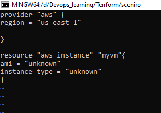
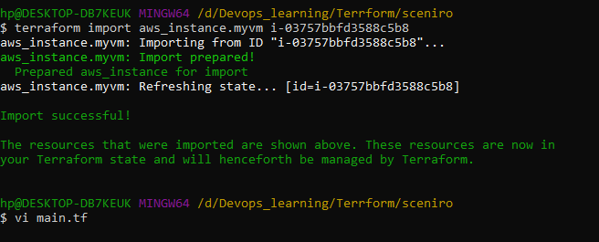
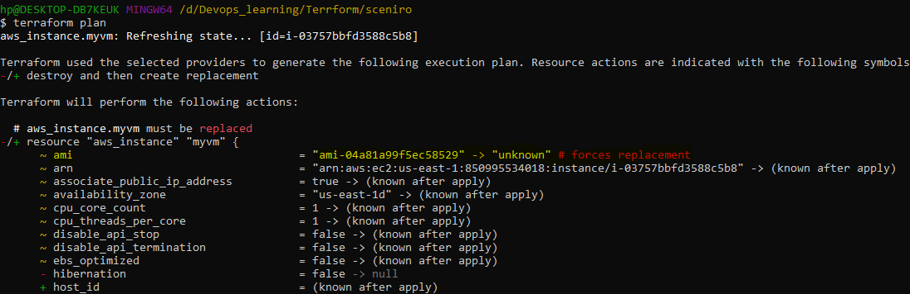

# scenario based interview Question 

1.  we have service running on aws, we are using cloudformation as infrastructure as code, now we what to move to  terraform we need to created the state file for services. how that can be achived 

 -> we will use the import command. it will help to import the per-existing cloud resources into terraform state 
    syntax 
     terraform import take 2 arguments 
     - ADDR - the address of the resources in terraform (eg. aws_instances.instance_name)
     - ID - the resource ID in the cloud provider/k8s/database service/vcs service/ etc

     create the main.tf file in which only put the provider and resources which you need to created the state file 
     keep all resources blank like below 

     

     we will be inporting the resources with below command 

     terraform import aws_instance.myvm i-03757bbfd3588c5b8
     
     

     it will create the the terraform state file we will try to plan, in then we will know it will replace the value in main.tf with real value like below 
     

     we will replace the value in the main.tf   